# Design Patterns — A Beginner-Friendly Study Guide (GoF)

This guide explains the **Gang of Four (GoF)** object-oriented desigtablen patterns using a **pattern-first** study flow similar to structured interview curricula (for example resources that stress **recurring templates**, **problem shapes**, and **step-by-step reasoning**—a style associated with platforms such as [AlgoMonster](https://algo.monster/)): **recognize the situation → name the pattern → know the trade-offs → implement cleanly**. It is written for someone **new to patterns**, with plain-language problems, detailed flows, Python examples, real systems, and **interview questions with full answers** (each question includes an **Answer** section below).

**Structure of each pattern**

1. **TL;DR** — one sentence you can repeat in an interview.
2. **The problem** — what hurts in naive code.
3. **Why this pattern** — what principle it supports.
4. **When to use / when to skip** — avoid over-engineering.
5. **Diagram flow** — visual mental model.
6. **How it works** — step-by-step behavior.
7. **Python** — minimal but runnable illustration.
8. **Practical systems** — where you meet it in production.
9. **Real-world analogy** — memory hook.
10. **Common mistakes** — what interviewers probe.
11. **Related patterns** — how they connect.

---

## How to study (pattern-based learning)

1. **Read one category at a time** (Creational → Structural → Behavioral).
2. For each pattern, **cover the diagram and TL;DR first**, then read “How it works.”
3. **Re-implement the Python snippet from memory** the next day.
4. **Pair each pattern with “what breaks without it”** — that is how you justify it in design reviews.
5. After each section, do the **interview Q&A** aloud; answers are provided at the end of this document.

**Vocabulary**

- **Coupling:** How much one module depends on another’s internals. Lower is usually better.  
- **Cohesion:** How focused a module is on one purpose. Higher is usually better.  
- **Encapsulation:** Hide mutable state behind a small, stable interface.  
- **Polymorphism:** Code depends on abstractions (interfaces), not concrete classes.  
- **Open/Closed:** Open for extension (new types), closed for modification (no edits to old core files for every new feature).

---

## Table of contents

1. [GoF patterns at a glance (table)](#gof-patterns-at-a-glance-table)
2. [Creational patterns](#creational-patterns)
3. [Structural patterns](#structural-patterns)
4. [Behavioral patterns](#behavioral-patterns)
5. [Pattern cheat sheet (quick comparison)](#pattern-cheat-sheet-quick-comparison)
6. [Interview questions with full answers](#interview-questions-with-full-answers)

---

## GoF patterns at a glance (table)

Classic **Gang of Four** grouping: **Creational** (how objects are made), **Structural** (how they compose), **Behavioral** (how they collaborate). Each name in the Markdown table links to the matching section in this file.

If your viewer does not render the pipe table, use the **plain-text table** in the code block below—it is the same content, always visible.

### Markdown table (copy/paste-safe)

Use `|` at the start of every row, three columns, and a separator row with at least three dashes per cell.


| Creational patterns                   | Structural patterns     | Behavioral patterns                                 |
| ------------------------------------- | ----------------------- | --------------------------------------------------- |
| [Singleton](#singleton)               | [Adapter](#adapter)     | [Iterator](#iterator)                               |
| [Factory Method](#factory-method)     | [Bridge](#bridge)       | [Observer](#observer)                               |
| [Abstract Factory](#abstract-factory) | [Composite](#composite) | [Strategy](#strategy)                               |
| [Builder](#builder)                   | [Decorator](#decorator) | [Command](#command)                                 |
| [Prototype](#prototype)               | [Facade](#facade)       | [State](#state)                                     |
| —                                     | [Flyweight](#flyweight) | [Template Method](#template-method)                 |
| —                                     | [Proxy](#proxy)         | [Visitor](#visitor)                                 |
| —                                     | —                       | [Mediator](#mediator)                               |
| —                                     | —                       | [Memento](#memento)                                 |
| —                                     | —                       | [Chain of Responsibility](#chain-of-responsibility) |


*(Cells marked **—** mean “no pattern in this category for this row,” matching the usual GoF cheat sheet layout.)*

### Plain-text table (always viewable in the `.md` file)

```text
+----------------------+----------------------+--------------------------------+
| CREATIONAL           | STRUCTURAL           | BEHAVIORAL                     |
+----------------------+----------------------+--------------------------------+
| Singleton            | Adapter              | Iterator                       |
| Factory Method       | Bridge               | Observer                       |
| Abstract Factory     | Composite            | Strategy                       |
| Builder              | Decorator            | Command                        |
| Prototype            | Facade               | State                          |
| (none)               | Flyweight            | Template Method                |
| (none)               | Proxy                | Visitor                        |
| (none)               | (none)               | Mediator                       |
| (none)               | (none)               | Memento                        |
| (none)               | (none)               | Chain of Responsibility        |
+----------------------+----------------------+--------------------------------+
```

> This guide also covers **[Interpreter](#interpreter)**, another GoF behavioral pattern not included in the compact three-column layout above.

---

# Creational patterns

**Theme:** Control **object creation** so your code does not hard-code `new ConcreteThing()` everywhere. That hard-coding is what makes features expensive to add and tests painful to write.

---

## Singleton

**TL;DR:** Guarantee **one shared instance** in a process for a resource that must stay global (with all the trade-offs that implies).

### The problem

If every part of the app does `Config()` or `ConnectionPool()` on idiagrts own, you get **multiple pools**, **split configuration**, and **race conditions**. If you use raw global variables, you get **hidden dependencies** and **uncontrolled mutation**.

### Why this pattern

Centralizes creation and access so there is **one authoritative object** for that concern—**but** it is easy to abuse.

### When to use / when to skip

- **Use** when a true single instance is a **correctness requirement** in one process (e.g. one pool coordinator) *and* you accept test/workflow trade-offs—or you wrap it in injection for tests.  
- **Skip** in distributed systems where “global” is misleading (each machine has its own process memory). Prefer **dependency injection** of a shared interface.  
- **Skip** when you only need “one per request” or “one per thread”—those are different lifetimes.

### Diagram flow

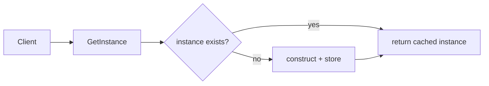


### How it works

1. A well-known access path (function or class) hands out **the same object** every time.
2. **First call** may construct; **later calls** return the cached reference.
3. In **multi-threaded** code you must **synchronize** creation (or use module import order in Python carefully).
4. **Testing** often requires **reset hooks** or **avoiding** the pattern in favor of injected fakes.

### Python

```python
# Python idiom: module-level singleton (import once, shared object)
class AppConfig:
    def __init__(self) -> None:
        self.region = "us-east-1"
        self.debug = False

config = AppConfig()

# Class-style lazy singleton (add threading.Lock in real MT code)
class ProcessWideRegistry:
    _instance: "ProcessWideRegistry | None" = None

    def __new__(cls) -> "ProcessWideRegistry":
        if cls._instance is None:
            cls._instance = super().__new__(cls)
        return cls._instance
```

### Practical systems

Process-wide **metrics registry**, **logging** configuration bootstrap, **in-memory rate limiter** state (single-node), legacy **DB connection pool** accessor.

### Real-world analogy

There is **one air-traffic tower** at an airport; pilots do not each spin up their own tower.

### Common mistakes

Treating singleton as a **license for global state**; forgetting **multi-process** deployment; **tight coupling** everywhere to `getInstance()`.

### Related patterns

**Facade** (single entry to subsystem); **Factory** (better for swappable implementations than `getInstance` for everything).

---

## Factory Method

**TL;DR:** Let a **creator subclass** decide which **product class** to instantiate so the client stays on **interfaces**.

### The problem

`if file_type == "pdf": ... elif file_type == "docx": ...` scattered through importing, rendering, and saving code duplicates knowledge and breaks every time you add a type.

### Why this pattern

Moves **which class to construct** behind a **virtual method** (`create_product()`). New file types = **new subclass**, often **without** editing the high-level workflow.

### When to use / when to skip

- **Use** when product families grow and creation logic is **stable per subclass** (per platform, per vendor, per format).  
- **Skip** when a **simple dict/registry** of callables is enough and you do not need inheritance structure.

### Diagram flow

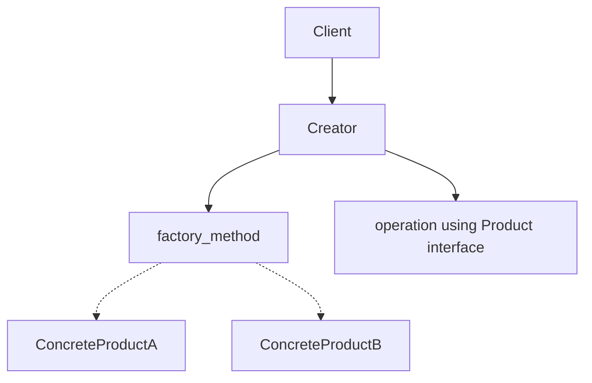


### How it works

1. **Abstract Creator** declares `factory_method()` returning **Abstract Product**.
2. **Concrete Creators** override `factory_method()` to return **their** product.
3. **Client code** uses only **abstract types**; it never names concrete product classes.

### Python

```python
from abc import ABC, abstractmethod

class Document(ABC):
    @abstractmethod
    def render(self) -> str: ...

class PdfDocument(Document):
    def render(self) -> str:
        return "<pdf/>"

class DocumentExporter(ABC):
    @abstractmethod
    def create_document(self) -> Document: ...

    def export(self) -> str:
        doc = self.create_document()
        return doc.render()

class PdfExporter(DocumentExporter):
    def create_document(self) -> Document:
        return PdfDocument()
```

### Practical systems

**Plugin loaders** (editor extensions), **ORM dialect** selection, **serialization** backends selected per deployment.

### Real-world analogy

A **recruitment agency** does not hard-code “hire Alice”; it calls “hire **a** role” and the **department** supplies the specific hire.

### Common mistakes

Putting **all** creation in one giant factory class with no polymorphic split—then you reinvent **Abstract Factory** or a **service locator** mess.

### Related patterns

**Abstract Factory** (whole families); **Template Method** (algorithm + one creation hook); **Prototype** (clone instead of construct).

---

## Abstract Factory

**TL;DR:** Create **matched sets** of objects (same “theme” or stack) so you never mix **incompatible** concretes.

### The problem

Dark theme needs **dark button + dark scrollbar**. If builders are independent, someone can pair **dark button + light scrollbar** by accident.

### Why this pattern

One factory interface returns **all related products**; each concrete factory is a **consistent bundle**.

### When to use / when to skip

- **Use** when you have **2+ dimensions** of variation that must stay coherent (theme × widgets, cloud × services).  
- **Skip** when products are **independent**—then **Factory Method** or a registry is simpler.

### Diagram flow

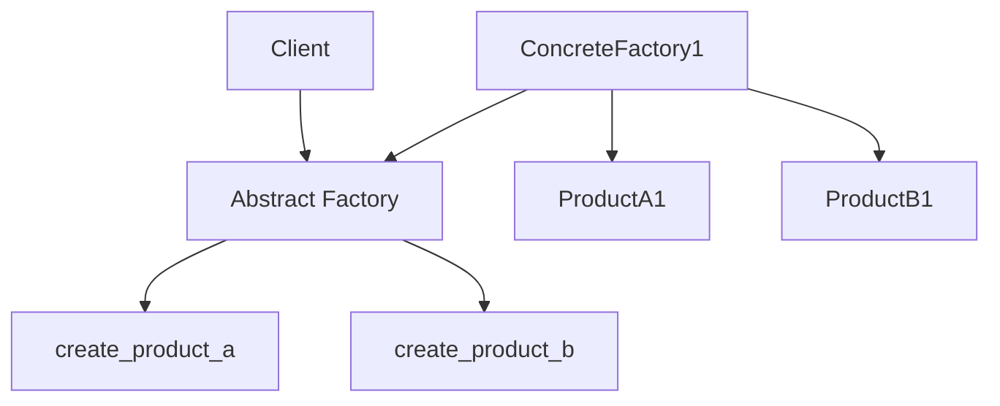


### How it works

1. **Abstract Factory** declares `createA()`, `createB()`, …
2. **ConcreteFactoryX** implements **all** methods so every product is from family **X**.
3. Client receives **only** the abstract factory interface and never names concrete pairs.

### Python

```python
from abc import ABC, abstractmethod

class Button(ABC):
    @abstractmethod
    def paint(self) -> str: ...

class Checkbox(ABC):
    @abstractmethod
    def paint(self) -> str: ...

class UIFactory(ABC):
    @abstractmethod
    def create_button(self) -> Button: ...
    @abstractmethod
    def create_checkbox(self) -> Checkbox: ...

class DarkButton(Button):
    def paint(self) -> str:
        return "dark-btn"

class DarkCheckbox(Checkbox):
    def paint(self) -> str:
        return "dark-check"

class DarkUIFactory(UIFactory):
    def create_button(self) -> Button:
        return DarkButton()
    def create_checkbox(self) -> Checkbox:
        return DarkCheckbox()
```

### Practical systems

**Multi-cloud SDK bundles** (AWS factory returns S3 client + Dynamo client from one kit), **mobile UI kits** per brand.

### Real-world analogy

A **meal combo**: burger + fries + drink chosen together—no “burger from Store A, fries from Store B” mismatch in one meal deal.

### Common mistakes

Exploding into **too many** factory interfaces for tiny apps; factory that also **does business logic** (keep creation focused).

### Related patterns

**Factory Method** (one product at a time); **Builder** (step-by-step *one* complex product).

---

## Builder

**TL;DR:** Build a **complex object in steps** with readable call chains and validation at `**build()`** time.

### The problem

Constructors with 12 optional arguments (“telescoping constructor”) are **error-prone** and **ambiguous** (`True, False, None`—what did that mean?).

### Why this pattern

Separates **construction steps** from **representation**, and lets you **enforce invariants** once at the end.

### When to use / when to skip

- **Use** for objects with **many optional fields** or **ordered steps** (HTTP requests, configs, test data).  
- **Skip** when a **dataclass** with defaults or `**@dataclass` + `**kwargs`** is enough and the team prefers simplicity.

### Diagram flow

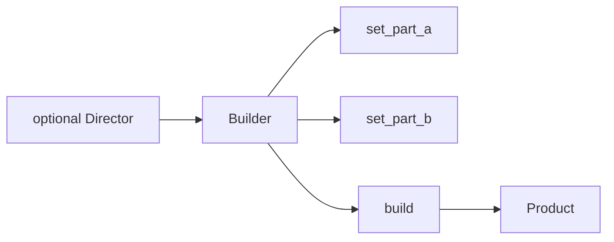


### How it works

1. **Builder** accumulates state through **fluent** methods.
2. `**build()`** validates and returns an **immutable** or fully-initialized product.
3. **Director** (optional) encodes a **recipe** for a common configuration.

### Python

```python
class HttpRequest:
    def __init__(self, method: str, url: str, headers: dict[str, str], body: bytes | None):
        self.method = method
        self.url = url
        self.headers = headers
        self.body = body

class HttpRequestBuilder:
    def __init__(self) -> None:
        self._method = "GET"
        self._url = ""
        self._headers: dict[str, str] = {}
        self._body: bytes | None = None

    def method(self, m: str) -> "HttpRequestBuilder":
        self._method = m
        return self

    def url(self, u: str) -> "HttpRequestBuilder":
        self._url = u
        return self

    def header(self, k: str, v: str) -> "HttpRequestBuilder":
        self._headers[k] = v
        return self

    def build(self) -> HttpRequest:
        if not self._url:
            raise ValueError("url required")
        return HttpRequest(self._method, self._url, self._headers, self._body)
```

### Practical systems

**SDK clients** (AWS `PutObjectRequest.builder()`), **SQL query builders**, **Dockerfile/multi-stage** config tools mentally map to “steps.”

### Real-world analogy

Ordering a **custom sandwich**: bread, protein, toppings one at a time; cashier **rings it up** only when the checklist is valid.

### Common mistakes

**Mutable product** leaking before `build()`; **no validation** so half-built objects escape.

### Related patterns

**Abstract Factory** (families of related products); **Composite** (tree built bottom-up sometimes uses builders).

---

## Prototype

**TL;DR:** **Clone** a template object instead of reconstructing from scratch when setup is **expensive** or **standardized**.

### The problem

Creating a “default” report/graph/game enemy requires **loading assets**, **registering handlers**, and **wiring subgraphs**. Doing that from zero every time wastes time and risks **drift** from “the standard template.”

### Why this pattern

**Copy** a master instance; tweak **extrinsic** state (position, id) on the copy.

### When to use / when to skip

- **Use** when construction is **heavy** or you want **versioned templates** (A/B config experiments).  
- **Skip** when construction is cheap and **deep copy** risks copying **non-duplicable** resources (open sockets, file handles).

### Diagram flow

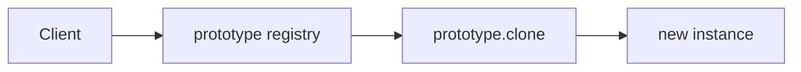


### How it works

1. Store a **prototype** instance (or rebuild from schema).
2. `**clone()`** returns **shallow** or **deep** copy depending on what must be shared.
3. Client adjusts **per-instance** fields.

### Python

```python
import copy
from dataclasses import dataclass, field

@dataclass
class Shape:
    name: str
    points: list[tuple[int, int]] = field(default_factory=list)

    def clone(self) -> "Shape":
        return copy.deepcopy(self)
```

### Practical systems

**Document templates** in editors, **game prefabs**, **ML experiment configs** duplicated from a baseline.

### Real-world analogy

**Photocopy** a permission slip, then write a **different student name** on each copy.

### Common mistakes

**Deep copying** things that should be **shared** (read-only metadata) or **must not** be duplicated (open connections, locks, handles).

### Related patterns

**Factory Method** (create fresh); **Memento** (snapshot for undo, not duplication for scale).

---

# Structural patterns

**Theme:** **Compose** objects and classes so you can **add behavior** or **simplify access** without ripping apart working code.

---

## Adapter

**TL;DR:** **Translate** one interface into another so **new** code can talk to **old** (or third-party) APIs.

### The problem

Your app expects `logger.info(msg)` but the vendor SDK only exposes `log_msg(text, severity_code)`.

### Why this pattern

**Isolates** translation in one class; callers stay on **your** stable interface.

### When to use / when to skip

- **Use** for **legacy**, **version skew**, or **multiple vendors** behind one port.  
- **Skip** if you **own** the code—sometimes **changing the API** is cheaper long-term than permanent adapters everywhere.

### Diagram flow

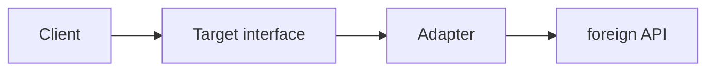


### How it works

1. **Target** is what the client codes against.
2. **Adapter** implements **Target** by **calling** **Adaptee** with translated arguments/results.
3. Optional: **two-way** adapters exist but grow complexity.

### Python

```python
class LegacyLogger:
    def log_msg(self, text: str) -> None:
        print("LEGACY:", text)

class AppLogger:
    def info(self, message: str) -> None: ...

class LoggerAdapter(AppLogger):
    def __init__(self, adaptee: LegacyLogger) -> None:
        self._adaptee = adaptee

    def info(self, message: str) -> None:
        self._adaptee.log_msg(message)
```

### Practical systems

**ORM** speaking dialect-specific SQL, `**requests`-shaped** client over a weird corporate HTTP library.

### Real-world analogy

**Travel plug adapter**: your charger’s prongs do not change; the wall socket does.

### Common mistakes

**Leaky adapter** that exposes adaptee types upward; **god adapter** that knows **every** legacy quirk.

### Related patterns

**Facade** (simplify a **subsystem**, not just one class); **Proxy** (same interface, different **purpose**—access control).

---

## Bridge

**TL;DR:** Split **what** something is (abstraction) from **how** it is implemented (platform/backend) so both dimensions evolve independently.

### The problem

Class explosion: `RedCircle`, `BlueCircle`, `RedSquare`, `BlueSquare`, … × **N** colors × **M** shapes.

### Why this pattern

**Compose** “shape” with a **renderer** interface instead of multiplying subclasses.

### When to use / when to skip

- **Use** when you have **two orthogonal axes** of change (UI vs OS, domain vs persistence).  
- **Skip** when a **single** implementation will never vary.

### Diagram flow

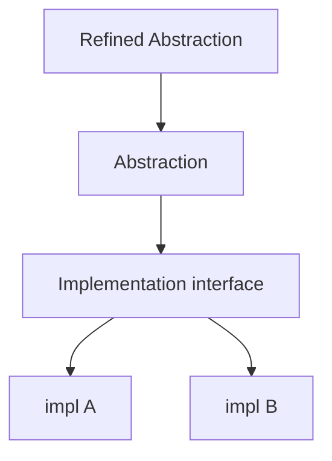


### How it works

1. **Abstraction** holds a reference to **Implementor**.
2. Methods on **Abstraction** delegate partial work to **Implementor**.
3. New **Implementor** does **not** require new **Abstraction** subclasses for unrelated reasons.

### Python

```python
from abc import ABC, abstractmethod

class Renderer(ABC):
    @abstractmethod
    def render_circle(self, r: float) -> str: ...

class VectorRenderer(Renderer):
    def render_circle(self, r: float) -> str:
        return f"vector circle r={r}"

class Shape(ABC):
    def __init__(self, renderer: Renderer) -> None:
        self._renderer = renderer

class Circle(Shape):
    def __init__(self, renderer: Renderer, radius: float) -> None:
        super().__init__(renderer)
        self._radius = radius

    def draw(self) -> str:
        return self._renderer.render_circle(self._radius)
```

### Practical systems

**UI frameworks** (views vs renderers), **storage layer** (file vs S3 implementing the same repository port).

### Real-world analogy

A **TV remote** (abstraction) works with many **TV brands** (implementation) via a standard IR protocol boundary.

### Common mistakes

**Leaking** implementation types into abstraction public API; too **thin** a bridge that is really just **Dependency Injection** with extra ceremony.

### Related patterns

**Adapter** (after-the-fact fit); **Strategy** (often the **implementation** role is strategy-like).

---

## Composite

**TL;DR:** Treat **trees** as one **component type**: operations recurse over **leaves** and **containers** the same way.

### The problem

Code distinguishes `File` vs `Folder` everywhere with duplicated loops and special cases.

### Why this pattern

**One interface** (`size`, `render`, `validate`) so clients stay simple; **polymorphism** handles recursion.

### When to use / when to skip

- **Use** for **recursive aggregates**: UI trees, ASTs, org charts, nested menus.  
- **Skip** when structures are **flat** or **DAG** semantics need special cycle handling beyond naive composite.

### Diagram flow

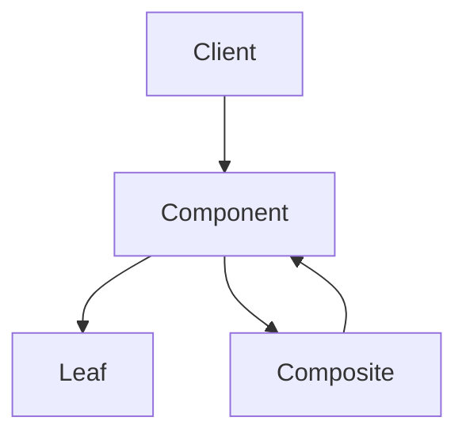


### How it works

1. **Component** interface: common operations.
2. **Leaf** implements base cases.
3. **Composite** **stores children** and implements operations by **delegating** and **aggregating**.

### Python

```python
from abc import ABC, abstractmethod

class Node(ABC):
    @abstractmethod
    def size(self) -> int: ...

class File(Node):
    def __init__(self, bytes_: int) -> None:
        self._bytes = bytes_
    def size(self) -> int:
        return self._bytes

class Folder(Node):
    def __init__(self) -> None:
        self._children: list[Node] = []
    def add(self, n: Node) -> None:
        self._children.append(n)
    def size(self) -> int:
        return sum(c.size() for c in self._children)
```

### Practical systems

**React-like** component trees (conceptually), **PDF** structure, **build systems** (targets and groups).

### Real-world analogy

**Org chart**: “What is the total headcount in this subtree?”—same question for a person (1) or a department (sum).

### Common mistakes

**Unsafe child management** (cycles), **type checks** everywhere defeating the pattern, **god Composite** with business rules.

### Related patterns

**Decorator** (single-child “composite-like” wrapping); **Visitor** (operations across the tree).

---

## Decorator

**TL;DR:** **Wrap** an object to **add** behavior at runtime; **stack** multiple wrappers that share one interface.

### The problem

Inheritance yields `LoggedEncryptedHttpClient`, `EncryptedLoggedHttpClient`, …—combinatorial subclass hell.

### Why this pattern

**Composition** of wrappers; order of wrapping = **pipeline semantics**.

### When to use / when to skip

- **Use** for **cross-cutting** layers: logging, metrics, retry, caching, compression.  
- **Skip** when behavior is **fixed** and simple—**one** subclass might be clearer.

### Diagram flow

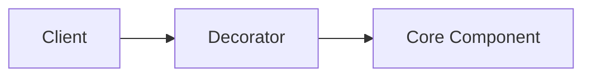


### How it works

1. **Decorator** implements **same interface** as **Component**.
2. It **delegates** to an inner component and **wraps** before/after behavior.
3. **Nested decorators** nest delegation.

### Python

```python
from abc import ABC, abstractmethod

class Notifier(ABC):
    @abstractmethod
    def send(self, msg: str) -> None: ...

class EmailNotifier(Notifier):
    def send(self, msg: str) -> None:
        print("email:", msg)

class SlackDecorator(Notifier):
    def __init__(self, inner: Notifier) -> None:
        self._inner = inner
    def send(self, msg: str) -> None:
        self._inner.send(msg)
        print("slack:", msg)
```

### Practical systems

**HTTP middleware**, **WSGI/ASGI** stacks, **Java I/O** streams (classic decorator teaching example).

### Real-world analogy

**Russian nesting dolls**: each layer adds an outfit; the inner doll is still “the doll.”

### Common mistakes

**Wrong wrapping order** (authenticate after logging secrets); **broken transparency** (decorator changes observable semantics unexpectedly).

### Related patterns

**Composite** (tree vs linear wrap); **Proxy** (often **one** concern: access, not open-ended feature stack).

---

## Facade

**TL;DR:** Offer a **small, stable API** over a **messy subsystem** so feature teams stop copy-pasting orchestration.

### The problem

Ten services to place an order: inventory, payment, fraud, tax, shipping labels, email—**each** client reorders calls differently and bugs diverge.

### Why this pattern

**One place** encodes the orchestration story; **subsystems** remain independent.

### When to use / when to skip

- **Use** when **integration complexity** is high and you want **onboarding** speed.  
- **Skip** when it becomes a **“god object”** that knows every domain rule—split facades by **bounded context**.

### Diagram flow

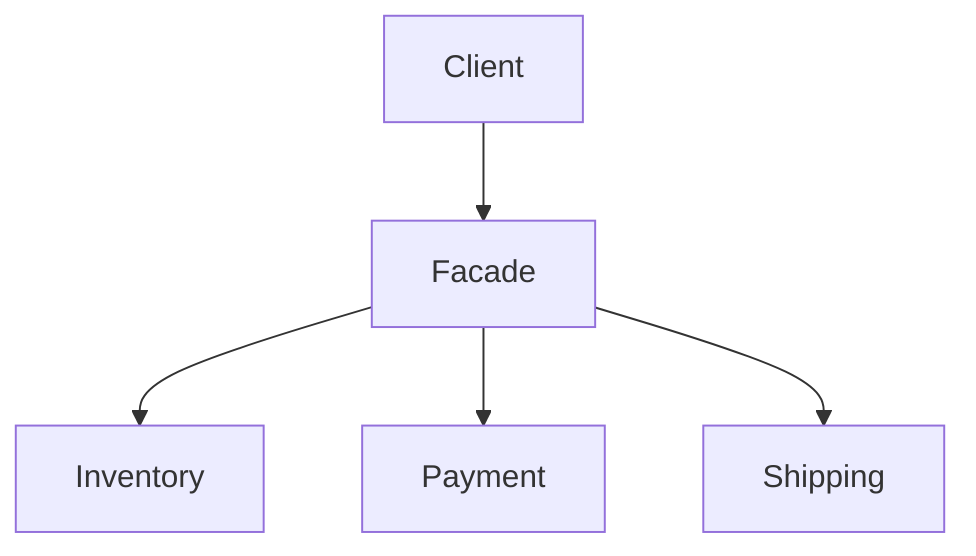


### How it works

1. **Facade methods** map **user intents** (“place order”) to **multi-step** calls.
2. **Subsystems** are not subclassed; they are **composed**.
3. Facade can **translate** exceptions into **domain errors**.

### Python

```python
class Inventory:
    def reserve(self, sku: str) -> bool:
        return True

class Payment:
    def charge(self, amount: int) -> bool:
        return True

class Shipping:
    def ship(self, address: str) -> None:
        print("ship to", address)

class CheckoutFacade:
    def __init__(self) -> None:
        self.inv = Inventory()
        self.pay = Payment()
        self.ship = Shipping()

    def place_order(self, sku: str, amount: int, address: str) -> bool:
        if not self.inv.reserve(sku):
            return False
        if not self.pay.charge(amount):
            return False
        self.ship.ship(address)
        return True
```

### Practical systems

**BFF** (backend-for-frontend) endpoints, **SDKs** wrapping REST chaos, internal **“OrderService.”**

### Real-world analogy

**Hotel concierge**—one desk coordinates restaurant, car, spa; you do not chase each vendor protocol.

### Common mistakes

**Facade as dumping ground** for all business logic; hiding **important** flexibility clients need (overly opaque).

### Related patterns

**Mediator** (coordinates **peers**, not just hides details); **Adapter** (interface translation to **one** foreign API).

---

## Flyweight

**TL;DR:** **Share** immutable “intrinsic” data across many instances; pass “extrinsic” context per use to save **memory**.

### The problem

A million text cells each storing full font metrics and Unicode tables **explodes memory**.

### Why this pattern

**Separate** what is **the same for many objects** (font glyph `A`, style 12pt bold) from what **differs** (x, y on screen).

### When to use / when to skip

- **Use** with **many** fine-grained objects and measurable memory wins (games, editors).  
- **Skip** when object count is low or **thread safety** of shared caches is harder than the savings.

### Diagram flow

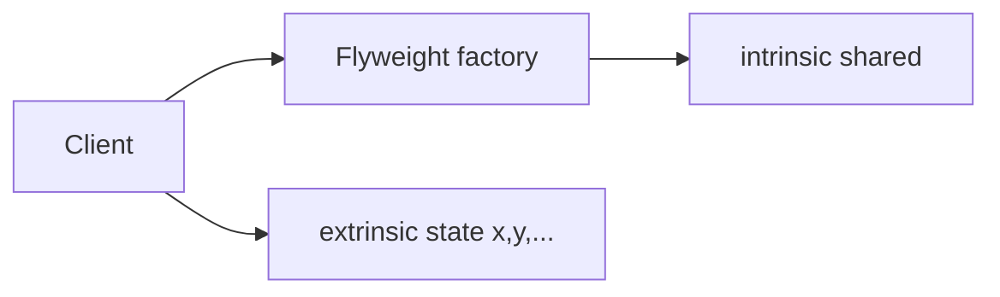


### How it works

1. **Flyweight** holds **shared** state; must be **immutable** or carefully synchronized.
2. **Factory** returns canonical instances per key (char + font).
3. **Methods** take **extrinsic** parameters (position).

### Python

```python
class Glyph:
    def __init__(self, char: str, font: str) -> None:
        self.char = char
        self.font = font

class GlyphFactory:
    def __init__(self) -> None:
        self._pool: dict[tuple[str, str], Glyph] = {}

    def get(self, char: str, font: str) -> Glyph:
        key = (char, font)
        if key not in self._pool:
            self._pool[key] = Glyph(char, font)
        return self._pool[key]
```

### Practical systems

**Text engines**, **tile maps**, **interned strings** (`sys.intern` mental model), **icon atlases**.

### Real-world analogy

One **stencil** (shared shape); many **spray positions** (extrinsic paint locations).

### Common mistakes

Putting **mutable** extrinsic state **inside** flyweight; **false sharing** bugs under concurrency.

### Related patterns

**Object pool** (reuse instances, different intent—recycling heavyweight objects, not splitting state); **Singleton** (one flyweight factory often is single).

---

## Proxy

**TL;DR:** **Stand in** for another object with the **same interface**—lazy init, caching, access control, or remote communication.

### The problem

Loading a 10 MB image on page load when the user might never scroll to it **wastes** I/O.

### Why this pattern

**Defer** work until needed; **intercept** calls to enforce rules.

### When to use / when to skip

- **Use** for **virtual proxies** (lazy load), **protection proxies** (authz), **remote proxies** (RPC stubs), **caching proxies**.  
- **Skip** when indirection **hurts** clarity more than it helps and behavior is **always** eager.

### Diagram flow

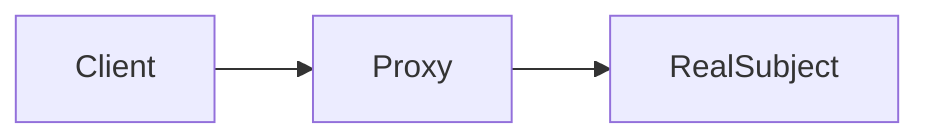


### How it works

1. **Proxy** implements **Subject** interface.
2. On call, it may **check cache**, **check permissions**, **create** real subject, then **forward**.
3. Client **should not** distinguish proxy vs real except for performance.

### Python

```python
from abc import ABC, abstractmethod

class Image(ABC):
    @abstractmethod
    def display(self) -> None: ...

class RealImage(Image):
    def __init__(self, path: str) -> None:
        self._path = path
        self._load_from_disk()
    def _load_from_disk(self) -> None:
        print("loading", self._path)
    def display(self) -> None:
        print("show", self._path)

class ProxyImage(Image):
    def __init__(self, path: str) -> None:
        self._path = path
        self._real: RealImage | None = None
    def display(self) -> None:
        if self._real is None:
            self._real = RealImage(self._path)
        self._real.display()
```

### Practical systems

**ORM lazy relations**, **CDN edge caches**, **gRPC clients**.

### Real-world analogy

**Receptionist** for a busy executive: schedules, filters visitors, sometimes answers without waking the exec.

### Common mistakes

**Stale cache** semantics; **hidden latency**; proxy that **changes** contract (throws new errors type).

### Related patterns

**Decorator** (adds features; intent differs); **Adapter** (changes interface shape).

---

# Behavioral patterns

**Theme:** **Algorithms and communication** between objects—who decides what, who notifies whom, and how responsibilities move.

---

## Chain of Responsibility

**TL;DR:** Pass a request along a **chain** until some handler **handles** it or it **falls off** the end.

### The problem

Giant `if role == X elif role == Y elif ...` for approvals; reordering rules requires **rewiring** central code.

### Why this pattern

Each handler knows **only** “can I handle this? if not, forward.” **Open/closed** for new handlers.

### When to use / when to skip

- **Use** for **middleware**, **approval pipelines**, **exception translation layers**.  
- **Skip** when order is **rarely** changed and a **simple list of functions** is clearer; watch **debugging** difficulty.

### Diagram flow

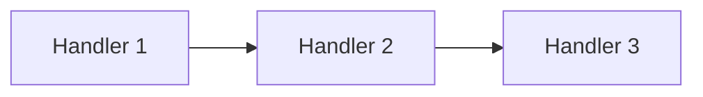


### How it works

1. Handler holds **reference to next**.
2. `**handle()`** either **processes** or **delegates**.
3. Client only submits to **head** of chain.

### Python

```python
from abc import ABC, abstractmethod

class Handler(ABC):
    def __init__(self) -> None:
        self._next: Handler | None = None
    def set_next(self, h: "Handler") -> "Handler":
        self._next = h
        return h
    @abstractmethod
    def handle(self, amount: int) -> str | None: ...

class Manager(Handler):
    def handle(self, amount: int) -> str | None:
        if amount <= 1000:
            return "manager approved"
        return self._next.handle(amount) if self._next else None
```

### Practical systems

**HTTP middleware**, **logging filters**, **support ticket routing**.

### Real-world analogy

**Call center escalation**: L1 tries, passes to L2 if needed.

### Common mistakes

**Silent failures** when nothing handles; **cycles** in chain; unclear **metrics** on where requests die.

### Related patterns

**Composite** (tree traversal); **Decorator** (linear wrapping, different intent).

---

## Command

**TL;DR:** Turn an action into an **object** you can **queue**, **log**, **undo**, or **compose** into macros.

### The problem

GUI buttons directly call fragile methods; you cannot **replay**, **undo**, or **serialize** user operations.

### Why this pattern

**Decouple invoker** (UI, scheduler) from **receiver** (document, device); **commands** are first-class values.

### When to use / when to skip

- **Use** for **job queues**, **transaction scripts**, **undo stacks**, **remote RPC** modeling.  
- **Skip** for trivial one-shot calls with **no** auditing/undo needs.

### Diagram flow

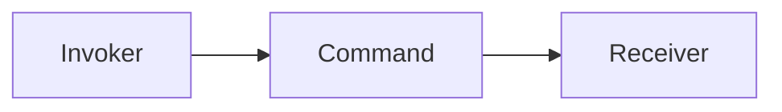


### How it works

1. **Command** interface: `execute()`, sometimes `undo()`.
2. **ConcreteCommand** captures **receiver** + args.
3. **Invoker** stores and triggers commands; **history** stores for undo.

### Python

```python
from abc import ABC, abstractmethod

class Command(ABC):
    @abstractmethod
    def execute(self) -> None: ...

class Light:
    def on(self) -> None:
        print("light on")

class LightOnCommand(Command):
    def __init__(self, light: Light) -> None:
        self._light = light
    def execute(self) -> None:
        self._light.on()

class Remote:
    def __init__(self) -> None:
        self._cmd: Command | None = None
    def set_command(self, c: Command) -> None:
        self._cmd = c
    def press(self) -> None:
        if self._cmd:
            self._cmd.execute()
```

### Practical systems

**Celery tasks** (command-like), **event sourcing** write side, **CI pipeline steps**.

### Real-world analogy

**Macro recorder** in Excel: each action is a stored command replayable later.

### Common mistakes

**Fat commands** that duplicate domain service logic—keep commands **thin** orchestrators when possible.

### Related patterns

**Memento** (store state for undo); **Composite** (macro commands).

---

## Interpreter

**TL;DR:** Represent a **grammar** with an **AST** and **evaluate** by recursive interpretation.

### The problem

You need a **small language** (rules, filters, expressions) without shipping a full compiler toolchain.

### Why this pattern

**Class per grammar rule**; easy to add **new operations** via visitors—or add **new syntax** via new node types (trade-off).

### When to use / when to skip

- **Use** for **tiny DSLs**, **policy engines**, **search query** mini-languages.  
- **Skip** when **parsing** + **maintenance** cost exceeds using **JSON config** or a mature engine.

### Diagram flow

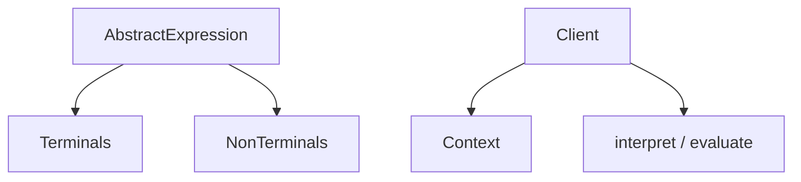


### How it works

1. Parse input → **AST**.
2. Each node implements `**interpret(context)`** (or accept a visitor).
3. **Context** holds variable bindings.

### Python

```python
class Expr:
    def interpret(self, ctx: dict[str, int]) -> int:
        raise NotImplementedError

class Number(Expr):
    def __init__(self, value: int) -> None:
        self.value = value
    def interpret(self, ctx: dict[str, int]) -> int:
        return self.value

class Var(Expr):
    def __init__(self, name: str) -> None:
        self.name = name
    def interpret(self, ctx: dict[str, int]) -> int:
        return ctx[self.name]

class Add(Expr):
    def __init__(self, left: Expr, right: Expr) -> None:
        self.left, self.right = left, right
    def interpret(self, ctx: dict[str, int]) -> int:
        return self.left.interpret(ctx) + self.right.interpret(ctx)
```

### Practical systems

**Spreadsheet formulas**, **SQL** planners (far larger), **regex** engines at a high level.

### Real-world analogy

**Phrasebook grammar**: noun + verb + object; each pattern is interpretable.

### Common mistakes

**Performance cliffs** on large inputs; **no error messages**—add source locations early.

### Related patterns

**Visitor** (operations separate from grammar); **Composite** (AST is a tree).

---

## Iterator

**TL;DR:** Expose **sequential access** to a collection **without** revealing its internal storage.

### The problem

Clients reach into `tree._root` or `list._items`, coupling to representation changes.

### Why this pattern

**Uniform** `for x in collection:` loops; many structures (array, BST, file stream) **same usage**.

### When to use / when to skip

- **Use** (usually via language support) whenever you build **custom collections**.  
- **Skip** over-engineering when **lists** suffice.

### Diagram flow

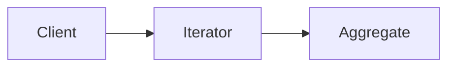


### How it works

1. **Aggregate** exposes `create_iterator()`.
2. **Iterator** tracks position; `**next()`** advances; `**has_next()`** or **StopIteration** ends.
3. Python: `**__iter__` / `__next__`**.

### Python

```python
class Bookshelf:
    def __init__(self) -> None:
        self._books: list[str] = []
    def add(self, b: str) -> None:
        self._books.append(b)
    def __iter__(self):
        return iter(self._books)
```

### Practical systems

**DB cursors**, **Kafka consumers**, **pagination APIs**.

### Real-world analogy

**Playlist “next track”** button without knowing if songs live on disk or stream.

### Common mistakes

**Concurrent modification** bugs; iterators that **leak** expensive resources without context managers.

### Related patterns

**Composite** (iterate trees); **Visitor** (external iteration vs internal).

---

## Mediator

**TL;DR:** Stop **many-to-many** colleague chatter; route events through a **mediator** hub.

### The problem

UI widgets reference each other directly: list box, text field, button—every new widget **O(n²)** wiring.

### Why this pattern

**Colleagues** know only **mediator**; **mediator** encodes interaction rules centrally.

### When to use / when to skip

- **Use** for **complex dialog boxes**, **chat servers**, **orchestrated workflows**.  
- **Skip** when interactions are **simple**—mediator can become a **god class**.

### Diagram flow

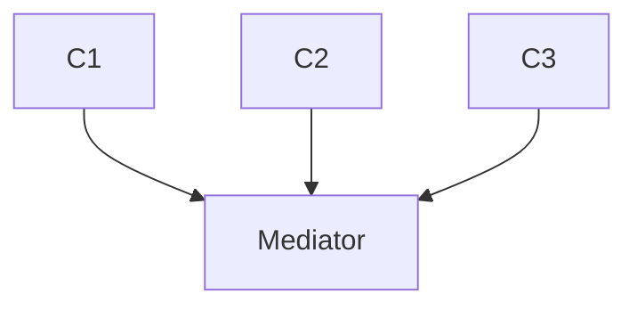


### How it works

Components `**notify(event)**` mediator; mediator **calls** other components as needed.

### Python

```python
from abc import ABC, abstractmethod

class Mediator(ABC):
    @abstractmethod
    def notify(self, sender: "Colleague", event: str) -> None: ...

class Colleague:
    def __init__(self, med: Mediator) -> None:
        self._med = med

class UiButton(Colleague):
    def click(self) -> None:
        self._med.notify(self, "click")

class Dialog(Mediator):
    def notify(self, sender: Colleague, event: str) -> None:
        if event == "click":
            print("dialog reacts centrally")
```

### Practical systems

**Front-end state stores** (conceptually), **lobby servers** in games, **air traffic** systems.

### Real-world analogy

**Conference call host** mutes/unmutes participants instead of pairwise shouting.

### Common mistakes

**Mediator absorbs all domain logic**—keep it **coordination**, not **business rules** soup.

### Related patterns

**Observer** (broadcast changes); **Facade** (simplifies external API, not peer graph).

---

## Memento

**TL;DR:** **Snapshot** an object’s state for **undo**/**restore** **without** breaking its encapsulation.

### The problem

`editor.text = old_text` from outside violates **invariants** and leaks fields.

### Why this pattern

**Originator** creates **memento** objects **it** understands; **caretaker** stores them **opaque**.

### When to use / when to skip

- **Use** for **undo stacks**, **save games**, **checkpoint/rollback**.  
- **Skip** when persistence is **whole-document** file save only—maybe **serialization** is enough.

### Diagram flow

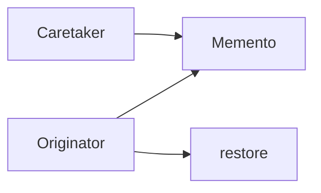


### How it works

1. `**create_memento()**` copies **internal state** into an immutable bag.
2. **Caretaker** keeps a **stack** of mementos (no peek inside).
3. `**restore(memento)`** reapplies state **through** originator methods.

### Python

```python
from dataclasses import dataclass

@dataclass(frozen=True)
class EditorMemento:
    text: str

class Editor:
    def __init__(self) -> None:
        self.text = ""
    def type(self, s: str) -> None:
        self.text += s
    def save(self) -> EditorMemento:
        return EditorMemento(self.text)
    def restore(self, m: EditorMemento) -> None:
        self.text = m.text
```

### Practical systems

**IDE local history**, **VM snapshots**, **DB transactions** (conceptually related).

### Real-world analogy

**Save slot** in a game—you don’t edit memory bytes; you **load** the packaged snapshot.

### Common mistakes

**Huge** mementos (diff stores help); **caretaker** mutating memento internals.

### Related patterns

**Command** (undo by inverse op or by memento); **State** (live state machine vs snapshot).

---

## Observer

**TL;DR:** **Publish events** to many **subscribers** who **react** without the subject knowing their types.

### The problem

Polling (“any news?”) wastes CPU; tight references from subject to **concrete** UIs are brittle.

### Why this pattern

**One-to-many dependency** with loose coupling; classic **event-driven** backbone.

### When to use / when to skip

- **Use** for **domain events**, **model-view** sync, **pub/sub** inside a process.  
- **Skip** when flow is **strictly linear** and debugging broadcast is painful—consider **explicit** calls.

### Diagram flow

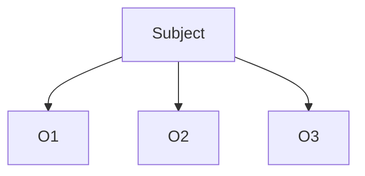


### How it works

1. **Observers** **register** with subject.
2. On change, subject `**notify()`** all.
3. **Push** (send data) vs **pull** (observers query) trade-offs.

### Python

```python
from typing import Callable

class Subject:
    def __init__(self) -> None:
        self._observers: list[Callable[[str], None]] = []
    def subscribe(self, fn: Callable[[str], None]) -> None:
        self._observers.append(fn)
    def emit(self, event: str) -> None:
        for fn in self._observers:
            fn(event)
```

### Practical systems

**Webhooks** (conceptually outbound observers), **GUI data binding**, **Kafka-style** buses at macro scale.

### Real-world analogy

**News mailing list**: publisher sends once; subscribers read independently.

### Common mistakes

**Notification re-entrancy** (A notifies B notifies A); **memory leaks** holding strong refs; **thundering herds**.

### Related patterns

**Mediator** (central router); **Chain of Responsibility** (pass along, not broadcast).

---

## State

**TL;DR:** Model behavior changes as **objects** representing **states**, not giant `switch(status)`.

### The problem

Methods check five flags to decide legality of transitions—**easy** to create **illegal** combos.

### Why this pattern

Each **state class** encapsulates **allowed operations** and **transition hooks**; context delegates to `self.state`.

### When to use / when to skip

- **Use** for clear **finite state machines**: TCP, orders, media players, approvals.  
- **Skip** for **two** states where **if/else** is clearer.

### Diagram flow

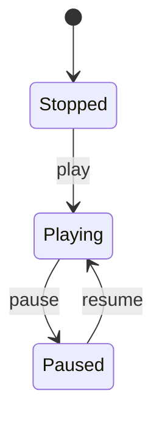


### How it works

1. **Context** holds **current State** reference.
2. **Requests** delegate to state object.
3. States **replace** themselves on transitions (`ctx.state = PlayingState()`).

### Python

```python
from abc import ABC, abstractmethod

class PlayerState(ABC):
    @abstractmethod
    def play(self, ctx: "Player") -> None: ...

class StoppedState(PlayerState):
    def play(self, ctx: "Player") -> None:
        print("playing")
        ctx.state = PlayingState()

class PlayingState(PlayerState):
    def play(self, ctx: "Player") -> None:
        print("already playing")

class Player:
    def __init__(self) -> None:
        self.state: PlayerState = StoppedState()
    def play(self) -> None:
        self.state.play(self)
```

### Practical systems

**Order lifecycle**, **payments state machines**, **game AI** modes.

### Real-world analogy

**Traffic light** modes: behavior and legal transitions depend on current color.

### Common mistakes

**States** reaching into **too many** context fields; forgetting **entry/exit** actions.

### Related patterns

**Strategy** (same shape, different intent); **Memento** (persist state snapshots).

---

## Strategy

**TL;DR:** **Inject** algorithms behind a common interface; choose at **runtime** without subclassing the context.

### The problem

`if pricing == "black_friday": ... elif ...` duplicated across cart, checkout, and refunds.

### Why this pattern

**Composition** over inheritance: `cart` has a `**PricingStrategy`**.

### When to use / when to skip

- **Use** for swappable **pure algorithms** (sort, routing, validation rules).  
- **Skip** when strategies need **rich** access to **private** context—consider **Template Method** or refactor access.

### Diagram flow

```mermaid
flowchart LR
  Context --> Strategy
  Strategy --> ImplA
  Strategy --> ImplB
```


### How it works

1. **Strategy** interface declares algorithm.
2. **Context** stores reference; **delegates** at call time.
3. Clients may **swap** strategy objects freely.

### Python

```python
from abc import ABC, abstractmethod

class PayStrategy(ABC):
    @abstractmethod
    def pay(self, amount: int) -> None: ...

class CardPayment(PayStrategy):
    def pay(self, amount: int) -> None:
        print("card", amount)

class Cart:
    def __init__(self, strategy: PayStrategy) -> None:
        self._strategy = strategy
    def checkout(self, amount: int) -> None:
        self._strategy.pay(amount)
```

### Practical systems

**Shipping calculators**, **compression codecs**, **ML model backends** swappable per tenant.

### Real-world analogy

GPS **routing mode**: fastest vs no tolls—same app, different **strategy plugin**.

### Common mistakes

**Leaking** strategy-specific exceptions; **mega-strategy** interfaces.

### Related patterns

**Bridge** (implementation dimension); **State** (states encode **transition** knowledge too).

---

## Template Method

**TL;DR:** Define an algorithm **skeleton** in a base class; let subclasses **fill in** specific **steps**.

### The problem

Copy-paste of “load, parse, validate, save” across formats with only **parse** differing.

### Why this pattern

**Reuse** invariant sequence; **hooks** for variants; **inversion of control**.

### When to use / when to skip

- **Use** in **frameworks** ( lifecycle hooks), **ETL** with fixed phases. Less flexible than Strategy at runtime unless you pass hooks.

### Diagram flow

```mermaid
flowchart TB
  T[template_method]
  T --> A[step A concrete]
  T --> B[step B abstract hook]
  T --> C[step C concrete]
```


### How it works

1. `**template_method()**` calls steps in order.
2. Some steps are **concrete**; some `**abstractmethod`**.
3. Subclasses **cannot** easily reorder skeleton without **violating Liskov**—that is the trade-off.

### Python

```python
from abc import ABC, abstractmethod

class Report(ABC):
    def generate(self) -> str:
        data = self.load_data()
        body = self.format(data)
        return self.footer(body)

    def load_data(self) -> list[str]:
        return ["row1", "row2"]

    @abstractmethod
    def format(self, rows: list[str]) -> str: ...

    def footer(self, body: str) -> str:
        return body + "\n-- end --"

class CsvReport(Report):
    def format(self, rows: list[str]) -> str:
        return ",".join(rows)
```

### Practical systems

**Unit test frameworks** (`setup/test/teardown`), **web** `on_request` pipelines with subclass hooks.

### Real-world analogy

**Baking recipe**: oven temp and timing fixed; **icing flavor** varies.

### Common mistakes

**Fragile** base class problem—adding a new step **breaks** all subclasses.

### Related patterns

**Strategy** (composition replaces hooks); **Factory Method** often appears in templates.

---

## Visitor

**TL;DR:** Add **new operations** over a **stable object structure** by writing **new visitor classes** instead of editing every node type.

### The problem

Every new report (`export_json`, `lint`, `count_nodes`) adds methods to `**class File`**, `**class Folder`**, …—**touch** risk everywhere.

### Why this pattern

**Double dispatch**: `node.accept(visitor)` routes to `visitor.visitConcreteNode`, **centralizing** the operation.

### When to use / when to skip

- **Use** when **node types** are **stable** but **operations** churn (compilers, linters).  
- **Skip** when new **node types** are frequent—Visitor makes **adding types** painful (each visitor updated).

### Diagram flow

```mermaid
flowchart LR
  Client --> Visitor
  Node --> accept
  accept --> Visitor
```


### How it works

1. **Element** `accept(visitor)`
2. Visitor implements `**visitA`**, `**visitB`**, …
3. New operation = **new visitor class**.

### Python

```python
from abc import ABC, abstractmethod

class Visitor(ABC):
    @abstractmethod
    def visit_literal(self, n: "Literal") -> int: ...
    @abstractmethod
    def visit_add(self, n: "Add") -> int: ...

class Node(ABC):
    @abstractmethod
    def accept(self, v: Visitor) -> int: ...

class Literal(Node):
    def __init__(self, value: int) -> None:
        self.value = value
    def accept(self, v: Visitor) -> int:
        return v.visit_literal(self)

class Add(Node):
    def __init__(self, left: Node, right: Node) -> None:
        self.left, self.right = left, right
    def accept(self, v: Visitor) -> int:
        return v.visit_add(self)

class EvalVisitor(Visitor):
    def visit_literal(self, n: Literal) -> int:
        return n.value
    def visit_add(self, n: Add) -> int:
        return n.left.accept(self) + n.right.accept(self)
```

### Practical systems

**AST** tooling, **protobuf** walkers, **codegen**.

### Real-world analogy

**Tax preparation software**: same W-2 data visited by **federal** vs **state** calculators.

### Common mistakes

**Cyclic graphs** without visited-sets; **visitor** knowing **too much** domain policy.

### Related patterns

**Interpreter** (evaluate AST); **Composite** (structure visited).

---

# Pattern cheat sheet (quick comparison)


| Pattern          | Solves               | Think “…”                           |
| ---------------- | -------------------- | ----------------------------------- |
| Singleton        | one shared instance  | “single source of truth (careful!)” |
| Factory Method   | who constructs       | “subclass picks the class”          |
| Abstract Factory | consistent bundles   | “theme/story packs”                 |
| Builder          | many optional parts  | “fluent steps + validate”           |
| Prototype        | clone templates      | “copy adjust”                       |
| Adapter          | mismatched API       | “translate”                         |
| Bridge           | 2 axes of change     | “compose roles”                     |
| Composite        | trees                | “leaf vs folder same API”           |
| Decorator        | stack behavior       | “onion layers”                      |
| Facade           | simplify subsystem   | “concierge”                         |
| Flyweight        | memory               | “share immutable guts”              |
| Proxy            | intercept access     | “stand-in”                          |
| Chain            | pass until handled   | “escalation”                        |
| Command          | action as object     | “undo/queue/log”                    |
| Interpreter      | tiny language        | “AST eval”                          |
| Iterator         | hide collection      | “for-loop contract”                 |
| Mediator         | many peers           | “hub”                               |
| Memento          | snapshots            | “save slot”                         |
| Observer         | fan-out              | “pub/sub”                           |
| State            | FSM cleanly          | “objects = modes”                   |
| Strategy         | swappable algorithm  | “inject policy”                     |
| Template Method  | fixed skeleton       | “framework calls you”               |
| Visitor          | ops over stable tree | “double dispatch”                   |


---

# Interview questions with full answers

Study tip: read the **question**, cover the **answer**, and try to **paraphrase** the answer in your own words.

---

## Creational

### 1. When is a singleton harmful in distributed systems or testing? How do you replace it with dependency injection?

**Answer:** In **distributed** systems, each process has its own memory—there is **no global singleton across machines** unless you add external shared state (database, Redis). Misusing singletons can **hide** that fact and cause **split-brain** assumptions (“surely only one is writing”). In **testing**, singletons **retain state** across tests, cause **order-dependent flakes**, and make **parallel tests** unsafe. **Fix:** define an **interface** (`ConfigPort`, `ClockPort`, `IdGenerator`) and **construct once** in your app’s **composition root** (FastAPI `lifespan`, `main()`), passing dependencies into builders and route handlers. Tests inject **fakes**/`MagicMock`. If you keep a process singleton, **isolate** it behind an interface so tests can **replace** the implementation without importing hidden globals.

---

### 2. Give an example where Abstract Factory is warranted and Factory Method alone is not enough.

**Answer:** When you must create **several related products together** so they **stay compatible**. Example: a **UI toolkit** needs `ScrollBar`, `Button`, and `WindowFrame` that all match a **theme** (dark Material vs light Apple). A single Factory Method only returns **one** product kind; without an Abstract Factory you might accidentally compose a **dark** button with a **light** scrollbar. The Abstract Factory’s `create_button()`, `create_scrollbar()`, `create_frame()` on `**DarkUIFactory`** guarantees a **coherent family**. Factory Method fits better when only **one** product type varies per subclass.

---

### 3. Compare Builder to telescoping constructors and to optional kwargs in Python; when does Builder win for API stability?

**Answer:** **Telescoping constructors** (`__init__(a,b,c,...,z)`) explode as optional combinations grow; callers pass **positional noise** and break when order changes. **Optional kwargs** (`**kwargs` or many defaults) are fine for **simple** objects but weak for **invariants** (“if `https` then `cert` required”) unless you add manual validation—often scattered. **Builder** shines when: (1) construction is **multi-step** with readable names, (2) you want `**build()`** to **validate once**, (3) you evolve the API by **adding methods** instead of breaking positional signatures, (4) you need **immutable** results after build. For internal DTOs with few fields, `**dataclass`** defaults may beat Builder for simplicity.

---

### 4. When is deep copy dangerous in Prototype?

**Answer:** `deepcopy` duplicates **everything** reachable: **open file descriptors**, **sockets**, **thread locks**, **DB connections**, or **large caches** you meant to **share read-only**. It can duplicate **singleton-like** registries accidentally, cause **double-close** bugs, or become **slow** on deep object graphs. Prefer **explicit** cloning protocols: share **immutable** metadata, duplicate **per-instance** fields only, reset **IDs** and **handles**, and document what must be **shallow**.

---

## Structural

### 5. Adapter vs Facade vs Bridge—in one sentence each? Can one implementation mix concerns?

**Answer:** **Adapter** makes an **existing** incompatible API look like the **interface your client already uses** (post-hoc translation). **Facade** provides a **simpler unified entry** to a **whole subsystem** to reduce orchestration noise. **Bridge** **separates** abstraction from implementation so **two axes** vary independently (pre-planned structure). **Yes, mixing happens:** a class can both **adapt** a legacy payment client **and** **facade** several internal services—risk is a **bloated** class; split **ports** (adapter) from **workflow** (facade).

---

### 6. Decorator vs subclassing: how does decorator order matter?

**Answer:** Subclassing fixes **one** superposition (`LoggedEncryptedClient`). Decorators **compose at runtime** in a **chain**: `A(B(C))`. **Order matters** when effects are not commutative: **auth before logging** if logs must not leak secrets; **compression then encryption** vs **encryption then compression** changes security/efficiency; **retry around idempotency checks** vs outermost affects failure semantics. Document **canonical order**; integration-test **pipelines**.

---

### 7. Proxy vs Decorator—both wrap; how do intent and placement differ?

**Answer:** **Proxy** controls **access** to a **specific** subject: **lazy** creation, **caching**, **authz**, **remote** stub, **reference counting**. The interface should stay **behaviorally** as close to the real object as practical. **Decorator** **adds or modifies** behavior **transparently** in layers—often many decorators combine. **Colloquial test:** “Would you say we’re mostly **protecting/representing** the real object?” → Proxy. “Are we **augmenting** capabilities?” → Decorator. In practice names blur—read **intent** and **invariants**.

---

### 8. Flyweight: intrinsic vs extrinsic? Why thread safety issues?

**Answer:** **Intrinsic** state is **shared** across many flyweights (glyph shape, font identity)—should be **immutable**. **Extrinsic** state differs per use (x, y, color tint if not part of key)—passed **into methods** or stored outside. **Thread safety** breaks if the shared flyweight or cache mutates without locks, or if extrinsic state is **stored mutably** inside flyweights that are reused across threads. Use **immutable** flyweights, **thread-safe** caches, or **per-thread** contexts.

---

## Behavioral

### 9. Strategy vs State—both swap behavior; how do intent and swap frequency differ?

**Answer:** **Strategy** swaps **algorithms** the client often chooses for **flexibility** (pricing, shipping)—**states** of the *strategy object* are not the domain’s core model. **State** models the **object’s own lifecycle mode** (order: placed → paid → shipped); transitions are **domain rules**. **Frequency:** strategies may change **per request**; states change when **business events** fire. **Similarity:** both use **polymorphism**; naming and **where transitions are authorized** differ.

---

### 10. Template Method vs Strategy—who owns the skeleton? Testing implications?

**Answer:** **Template Method:** base class **owns** the algorithm skeleton; subclasses **override hooks**—**white-box** reuse via inheritance. **Strategy:** context **owns** control flow around **composed** strategy object—**black-box** reuse via composition. **Testing:** strategies are **easy** to mock/replace; template hierarchies can force **subclassing** to test variations and risk **fragile base class** issues when the skeleton changes.

---

### 11. Observer: how to avoid update storms, cycles, and memory leaks?

**Answer:** **Storms:** **debounce/batch**, **async** dispatch, **event coalescing**, or **push** minimal diffs. **Cycles:** avoid observers calling `**notify`** back into subjects that **re-notify**—use **reentrancy guards** or **queued** events; model **directed** flows. **Leaks:** **weak references** to observers in languages that need them, **unsubscribe** on teardown, `**weakref.WeakMethod`** patterns in Python for callbacks, or **scoped** subscription lifetimes (with contexts).

---

### 12. When does Chain of Responsibility become a debugging nightmare? Alternatives?

**Answer:** **Long opaque chains**, **silent drops** (no handler), **dynamic reorder**, and **side-effectful** handlers make failures hard to trace. **Mitigations:** **structured logging** with **correlation IDs**, **explicit** “no handler” outcomes, **unit-test** each link, **visualize** chain assembly. **Alternatives:** **pipeline** of pure functions with typed context, **rule engine** with explicit priority tables, **mediator/orchestrator** when routing is central domain logic—not just decoration.

---

### 13. Sketch undo/redo with Command + Memento.

**Answer:** **Command** stores `execute()` and either `**undo()`** (if inverse is cheap/safe) or references needed to reverse. **Memento** captures **full state snapshots** when inverse is hard (bitmap editor). Maintain **two stacks**: **undo stack** of executed commands or mementos; **redo stack** cleared on new commands. **Undo:** pop from undo, **restore** or `command.undo()`, push to redo. **Redo:** reverse. For **macro** commands, use **composite command**. Choose **command-level** undo vs **snapshot** undo based on **memory** and **correctness** under partial failures.

---

### 14. What is the expression problem, and how does Visitor relate?

**Answer:** The **expression problem** asks how to extend **both** data variants **and** operations **without** modifying existing code and **without** heavy duplication—most naive designs fail one direction. **Visitor** makes **adding new operations** easy (new visitor class) but **adding new node types** forces **editing every visitor**—good when **structure is stable** and **operations churn**. **Alternatives:** tagged unions with pattern matching (language-dependent), **multimethods**, or accepting **open modules** with some edits.

---

## System design crossover

### 15. Which patterns appear in reverse proxies, API gateways, middleware, event-driven systems—and failure modes?

**Answer:** **Reverse proxy/API gateway:** **Decorator/Chain** for **middleware** (auth, rate limit), **Facade** to unify many services, **Proxy** for **TLS termination** and **caching**. **Event-driven:** **Observer/pub-sub**, **Command** as **events**, **Chain** in **consumer pipelines**. **Failure modes:** middleware order bugs (**auth too late**), **caching staleness** (proxy), **retry storms** (observer fan-out), **tight coupling** to broker schemas, **poison messages** in chains without **DLQs**. Patterns don’t remove need for **timeouts**, **backpressure**, and **idempotency**.

---

### 16. Anti-patterns: “Singleton everything,” “God Facade,” “Observer spaghetti”—how to refactor?

**Answer:** **Singleton everything:** reintroduce **explicit lifetimes**—**inject** interfaces, shrink globals, use **factories** at startup. **God Facade:** **split** by **bounded context** (`CheckoutFacade`, `ReturnsFacade`), move rules to **domain services**, keep facades **thin orchestrators**. **Observer spaghetti:** **name events**, **version schemas**, introduce **mediators** or **state machines** for complex flows, **audit** who subscribes to what, prefer **sync boundaries** (queues) for clarity. Always refactor toward **clear ownership** of state transitions.

---

*Document path:* `docs/design-patterns-guide.md` *(repository-level `docs/`, outside per-project folders).*